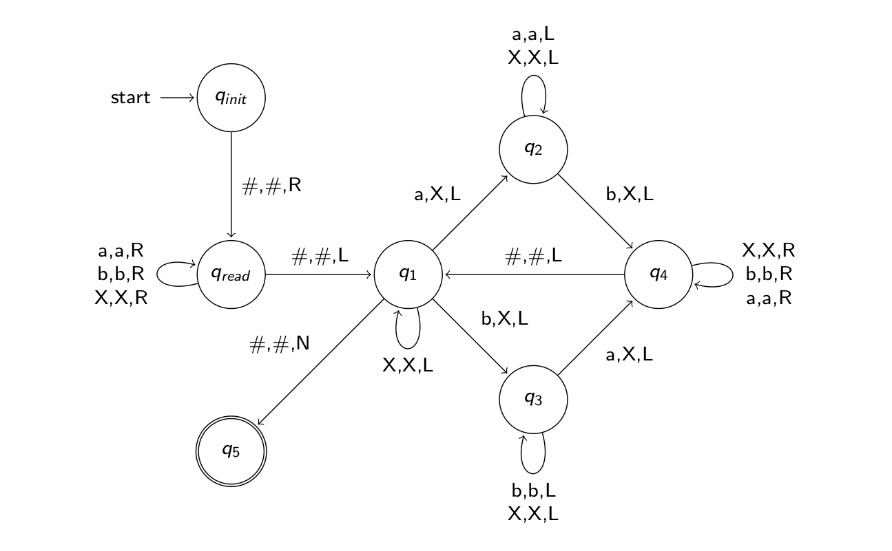

# Attention is Turing Complete

Implementation of the Transformer architecture described in the paper Attention is Turing Complete. I am not the author.

<a href='https://arxiv.org/pdf/1901.03429'></a>

## Usage

You only need numpy to run this

```
pip install numpy
```

To run the Transformer, do the following:

1. Go to [turing.py](turing.py)
2. Modify `symbols`, `states`, `transitions` and `accept_states` to represent your desired Turing Machine. Remember to modify it so that it also includes $q_{read}$.
3. Run
   ```bash
   python turing.py
   ```

:warning: **Disclaimer: This will most likely return an error due to the fact that we do not have infinite precision**

## Explanation

### Vectors and Embedding

For the Turing machine to recognize strings with equal number of a's and b's, we define

$$\Sigma = \\{ a, b, X, \\# \\}$$

$$Q = \\{ q_{init}, q_{read}, q_1, q_2, q_3, q_4\\} $$
Thus, we have the dimensions for the vectors in the Transformers
$$ d = 2|Q| + 4|\Sigma| + 11 = 14 + 16 + 11 = 41 $$

All vectors $\mathbf{v}$ used in the paper (and this implementation) are row vectors, and all matrices $\mathbf{K}$ have $\mathbf{K_i}$ as the $i^{th}$ row of that matrix

### Decoder

The Decoder will simulate the computational steps in the Turing Machine

#### First Decoder Layer: Simulates Transition Function of TM

The micellaneous functions are just means to simulate the transition function

#### Second Decoder Layer: Calculate the current position of the tape head

#### Third Decoder Layer: Calculates the symbol read at the position of the tape head

### Final Transformation Function

This can be implemented as a few feed-forward layers, in other words matrix multiplication. I ran out of time so I just used indexing and array concatenation for the sake of not having enough time.

### Example

The example provided in [turing.py](turing.py) is the Turing Machine that recognizes the following language

$$ L(M) = \\{ w | w \in \{ a,b \}^{\*} \text{ and } |a|=|b|\\} $$



## TODO

- [] Fix the FinalTransform class so that it actually uses matrix multiplication
- [] Find a way to round out the numbers so that this can work without infinite precision
